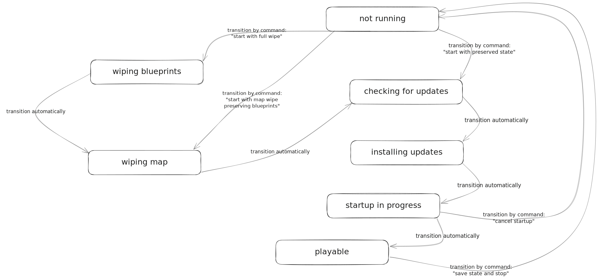

Work in progress!

# `rustctl`

Tooling for running a _Rust_ (the game) server and an integrated web service
on Linux.

## State machine



## Cheatsheet

#### Development

```console
$ cd ./frontend && ./node_modules/.bin/vite build && cd -
$ cd ./backend && cargo run -- start --web-root ../frontend/out/
$ tokio-console
```

#### Running a light server

It seems the minimum world size (settable with `+server.worldsize`) is 1000. In
order for a player to be able to spawn on such server, you must issue command
`antihack.terrain_protection 0` via RCON or somehow define a custom spawn point
because otherwise at least using the default seed 1337 players seem to spawn
under terrain.
