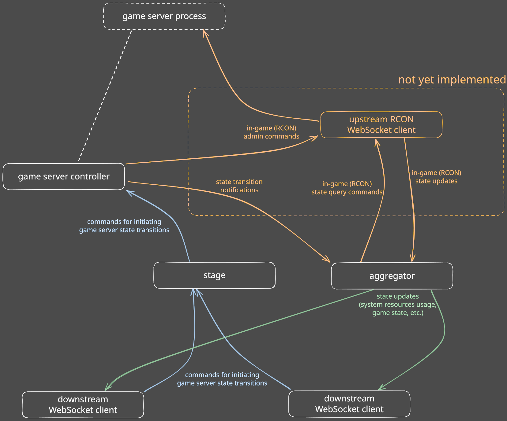

Work in progress!

# `rustctl`

Tooling for running a _Rust_ (the game) server and an integrated web service
on Linux.

## Features

Features are listed in the [`./CHANGELOG.md`](./CHANGELOG.md).

## Repository structure

```
.
├── clients
│   │
│   ├── tui ............. A terminal app: For development.
│   │
│   └── web ............. A web app: The actual app.
│
├── common .............. Shared libraries.
│
├── mocks
│   │
│   ├── RustDedicated ... Mocks the game server: For development.
│   │
│   └── steamcmd ........ Mocks the game server installer: For development.
│
└── server .............. Backend of the actual app: Manages the game server.
```

## State machine for managing the game server


## Actors in the server

The below diagram is an approximation as of commit `bbec67ba` (2025-07-27). This
is _not_ a clean, intentional design. Instead, this is a note about the emergent
structure that just happened. Some cleanup and restructuring would probably be
a good idea, at least once all the minimum required features have been somewhat
implemented!



## Cheatsheet

#### Using `steamcmd`

The program assumes `steamcmd` to be installed in `/usr/bin/steamcmd` which
is where the AUR package installs in. Some other package systems install it
elsewhere though (e.g. in Debian, `/usr/games/steamcmd` is made). Create a
symbolic link from the expected installation path to the actual installation
path if they differ:

```
$ ln -s /usr/games/steamcmd /usr/bin/steamcmd
```

The same idea might be useful in case you want to [mock](./mocks/) the
installer!

#### Running a light game server

It seems the minimum world size (settable with `+server.worldsize`) is 1000. In
order for a player to be able to spawn on such server, you must issue command
`antihack.terrain_protection 0` via RCON or somehow define a custom spawn point
because otherwise at least using the default seed 1337 players seem to spawn
under terrain.
