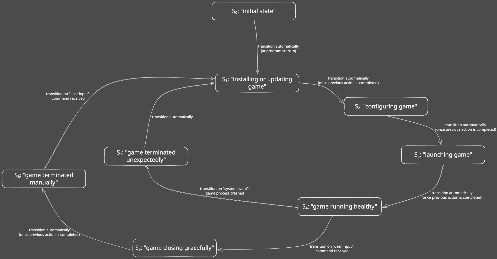
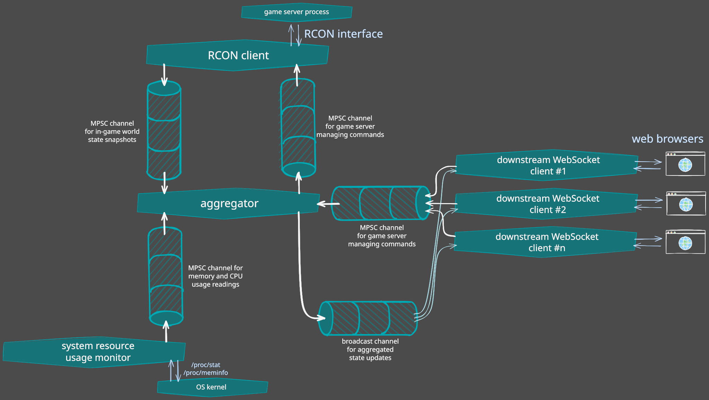

Work in progress!

# `rustctl`

Tooling for running a *Rust* (the game) server and an integrated web service
on Linux.

## Features

Features are listed in the [`./CHANGELOG.md`](./CHANGELOG.md).

## Repository structure

```
.
├── clients
│   │
│   ├── tui ............. Terminal app intended as a dev tool.
│   │
│   └── web ............. Web app intended as an actual deployment.
│
├── server .............. Backend for the clients.
│
└── common .............. Shared between the clients and the server.
```

## State machine managing the game server

An illustration of how the game server is managed, as a state machine:



## Actors in the server

Design diagram in terms of channel primitives:



## Presumed filesystem hierarchy

Various filesystem entries are presumed pre-existing or created at runtime
at specific paths. Below is a non-exhaustive list of some that might be
interesting. (Not in any meaningful order!)

```
/tmp/
│
├── rustctl.sock ................ Unix domain socket. Created at runtime.
│
└── rustctl/ .................... Temporary directory. Created at runtime as needed.

/usr/bin/
│
└── steamcmd .................... "SteamCMD": Game server installer. Presumed
                                  pre-installed. It's available via e.g. Debian,
                                  Ubuntu and Arch package managers.

/var/lib/rustctl/
│
├── rustctl.db .................. Generated at runtime.
│
├── rustctl.log ................. Generated at runtime.
│
├── carbon
│   │
│   ├── tools
│   │   └── environment.sh ...... Included in "Carbon" installation, which is
│   │                             downloaded from internet at runtime.
│   └── plugins
│       └── rustctl_sock.cs ..... Generated at runtime.
│
├── current-world-map.png ....... Generated at runtime.
│
├── libdoorstop.so .............. Included in the "Carbon" installation.
│
├── rustctl-run-with-carbon.sh .. Generated at runtime.
│
├── RustDedicated ............... The game server. Installed at runtime from
│                                 internet using "SteamCMD". Contains state
│                                 information relative to itself.
│
├── server
│   └── instance0 ............... Generated at runtime (by the game).
│       ├── cfg
│       │   └── users.cfg
│       └── *.sav
│
└── steamapps
    └── appmanifest_258550.acf .. Included in the "RustDedicated" installation.
```

## Development cheatsheet

- Start backend in its root:

  ```
  $ cargo run -- -i 192.168.0.103 -p 8080 --steam-id-append 76561198135242017
  ```

- Start web app dev server in its root:

  ```
  $ dx serve --platform web --addr 192.168.0.103 --port 8000
  ```

- SQLite cheatsheet:

  ```
  $ sqlite3 /var/lib/rustctl/rustctl.db

  sqlite> .tables

  sqlite> .schema

  sqlite> SELECT * FROM app_data_schema_version;
  0.1.0-rc1

  sqlite> .quit
  ```

- Bundle web app:

  ```
  $ cd ./clients/web
  $ dx bundle --platform web
  $ cd -
  $ mv ./target/dx/rustctl-web/release/web/public /var/lib/rustctl/web
  $ tree /var/lib/rustctl/web/ --prune
  /var/lib/rustctl/web/
  ├── assets
  │   ├── rustctl-web-10c6fdaee3286dde.js
  │   ├── rustctl-web-10c6fdaee3286dde.js.br
  │   ├── rustctl-web_bg-a5d465d285bbadf8.wasm
  │   └── rustctl-web_bg-a5d465d285bbadf8.wasm.br
  └── index.html
  ```

  The web server will serve the bundle from `/var/lib/rustctl/web/`.

- Try in a virtual machine (QEMU guest on Debian, using _virsh_):

  1. Get a disk image:

     ```
     $ wget https://cloud.debian.org/images/cloud/trixie/20251006-2257/debian-13-generic-amd64-20251006-2257.qcow2
     ```

  2. Create a _cloud-init_ disc (`seed.iso`):

     ```
     $ bash ./create-cloud-init-seed.sh

     $ file seed.iso
     seed.iso: ISO 9660 CD-ROM filesystem data 'cidata'
     ```

  3. Create and boot a VM with the virtual hard disk and the cloud-init disc attached:

     ```
     $ virt-install \
       --name debian-13 \
       --memory 8192 \
       --vcpus 4 \
       --disk ~/Downloads/debian-13-generic-amd64-20251006-2257.qcow2 \
       --disk path=seed.iso,device=cdrom \
       --import \
       --os-variant debian11 \
       --network network=default \
       --graphics vnc,listen=127.0.0.1 \
       --video qxl
     ```

  4. Download the `.deb` package built with `./build.sh`, from the host to the
     guest.

     For example, in the host, serve:

     ```
     $ cd ./target/debian/
     $ python3 -m http.server
     ```

     And then, in the guest, `wget`:

     ```
     $ wget http://192.168.122.1:8000/rustctl_0.1.0-rc2_amd64.deb
     ```

  **TODO:** Define the cloud-init so that `steamcmd` gets installed:

  1. Somewhere in `/etc/apt/sources.list.d/`, add `non-free`.

  2. Do `dpkg --add-architecture i386 && apt update`.

  3. Do `apt install -y steamcmd`. Also, figure out how to non-interactively
     accept the installer's prompts.

## Tips

### Using `steamcmd`

The program assumes `steamcmd` to be installed in `/usr/bin/steamcmd` which
is where the Arch Linux's AUR package installs in. Some other package systems
install it elsewhere though: E.g. Debian's APT creates `/usr/games/steamcmd`.
Create a symbolic link from the expected installation path to the actual
installation path if they differ:

```
$ ln -s /usr/games/steamcmd /usr/bin/steamcmd
```

### Using `virsh`

```
$ virsh list --all && virsh net-list --all && virsh pool-list --all

$ virsh shutdown debian-13
$ virsh destroy debian-13
$ virsh undefine debian-13
$ virt-manager

$ virsh snapshot-create-as debian-13 000_init
$ virsh snapshot-list debian-13
$ virsh snapshot-revert debian-13 000_init
$ virsh snapshot-delete debian-13 000_init
```

```
$ virsh domblklist debian-13

 Target   Source
---------------------------------------------------------------------------
 vda      /home/jka/Downloads/debian-13-generic-amd64-20251006-2257.qcow2
 sda      /home/jka/repos/rustctl/seed.iso

$ virsh detach-disk debian-13 sda --config
```
